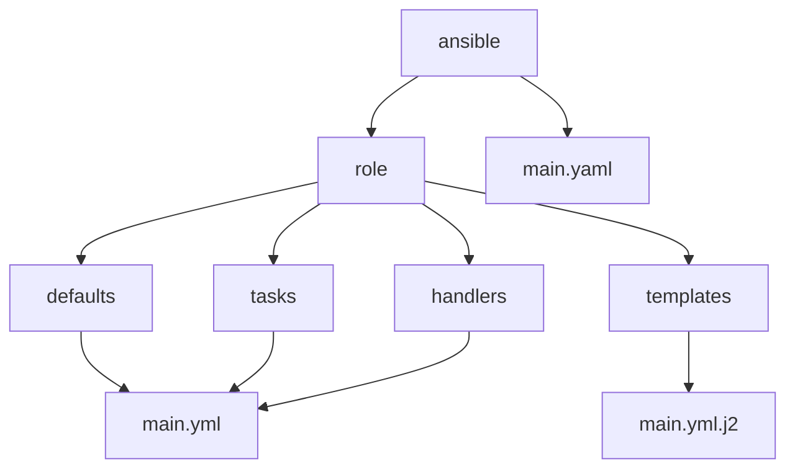

# Ansible role generator with files in the default manner



### Run this script via the following command

``` bash
wget -O - https://raw.githubusercontent.com/vortexdude/src/main/script.sh | bash

```

#### Give the name of the role

``` bash
wget -O - https://raw.githubusercontent.com/vortexdude/src/main/script.sh | bash -s my_role
```
